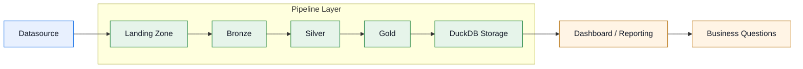
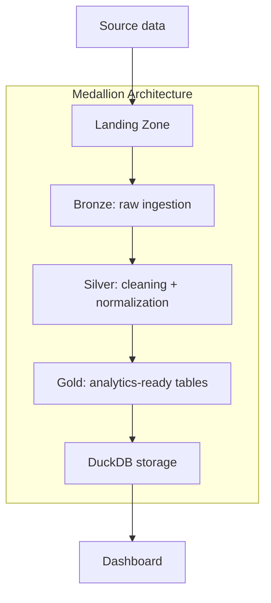
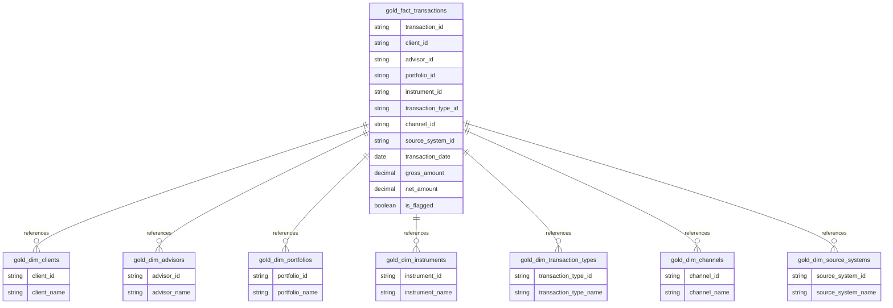

# Architecture

The overall setup is intentionally simple: a source file is loaded into a landing zone, transformed through a medallion pipeline, and then exposed through a small reporting layer.

## Zoom: pipeline component

## Why this shape

The design follows a common warehouse pattern because it separates concerns in a useful way:

- the landing zone is a raw capture area
- bronze keeps the ingest footprint simple
- silver focuses on data quality and consistency
- gold prepares the tables for analytics and quick review

This makes the system easier to reason about when the project grows, and it also gives a clean place to add extra sources or transformations without turning everything into one huge pipeline.

## Storage schema by layer

The storage model mirrors the medallion flow:

- Bronze: one raw table, `bronze.transaction`, storing the ingested source data as-is
- Silver: one curated table, `silver.transaction`, keeping the cleaned and standardized records
- Gold: a relational analytical layer with several dimension tables and a fact table

### Gold schema

The gold model is structured around a star schema:

- dimensions such as clients, advisors, portfolios, instruments, channels, and transaction types
- fact tables storing the business events and their foreign keys to the dimensions
- reporting queries joining the fact table to dimensions for KPIs and trend analysis

This keeps the warehouse simple while still making the analytical layer readable and maintainable.

## Data flow

The pipeline is built around a small, repeatable sequence:

1. source file is fetched into the landing zone
2. the bronze ingestor materializes the raw records into DuckDB
3. silver cleaners and standardizers prepare the data for use
4. gold loaders build dimension and fact tables
5. the dashboard reads the resulting analytical tables

That layering matters because the data quality decisions happen in a controlled place, instead of being mixed into the storage and reporting layers.

## Operational notes

This is a lightweight architecture designed for a personal or small-team environment. It is intentionally readable and easy to extend, but it is not a fully productionized warehouse stack. In a larger setup, I would add externalized configuration, schema governance, stronger data quality checks, and more formal monitoring around the medallion layers.
